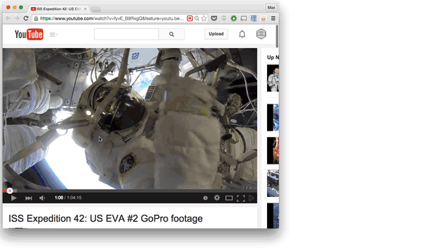

# playback-chrome

chrome extension that adds a button to youtube videos to 'play in playback'

## install

- clone this
- run `npm install`
- run `npm run build`
- in chrome's extensions ui do 'load unpacked extension' and point it at the 'extension' folder in this repo
- also install [Playback.app](https://github.com/mafintosh/playback) in Mac's Applications folder (note: **must** but in the Applications folder for this extension to work)
